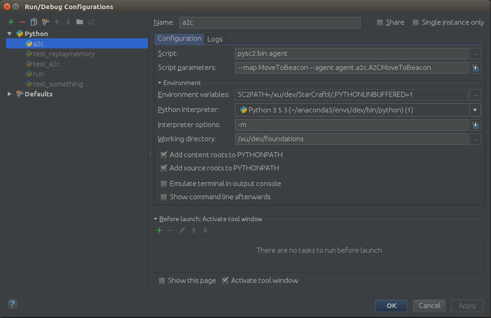

# Research Foundations

# Setup and install
Follow instructions at [pysc2 github](https://github.com/deepmind/pysc2)

# Creating a new agent
create a python file in agent dir and inherit from pysc2.agents.base_agent similar to [pysc2_agents.py](agent/sc2/pysc2_agents.py)

e.g. [a2c.py](agent/sc2/actor_critic.py) (this is just a copy of a scripted agent for now)

# Running an agent
### Running from bash
```bash
export SC2PATH=/[your path to]/StarCraftII/
# e.g. run the scripted agent CollectMineralShards from the pysc2_agents.py file in the agent dir 
python -m pysc2.bin.agent --map CollectMineralShards --agent agent.pysc2_agents.CollectMineralShards
```
### Running in pycharm - using deepmind agent runner
configure runner similar to below, using your own interpreter ofcourse



### Running in pycharm - using local agent runner
configure the Defaults in run configuration to be similar to above 
(for the Environment section only)  
change the agent and map by modifying this lines in custom_agent.py
```python
flags.DEFINE_string("agent", "agent.a2c.A2CMoveToBeacon",
...
flags.DEFINE_string("map", "MoveToBeacon", "Name of a map to use.")
```
run custom_agent.py from pycharm "right click in project explorer -> run". 

# Observation space
At each timestep the agent will receive observations "obs" in the step function  
```python
obs.step_type
obs.reward
obs.discount
obs.observation
```
#### obs.observation 
is a NamedDict containing
```python
action_result
alerts
available_actions
build_queue
cargo
cargo_slots_available
control_groups
feature_minimap
feature_screen
game_loop
last_actions
multi_select
player
score_cumulative
single_select
```

#### obs.observation.feature_screen 
is a 17 layer tensor of 84x84 size (per screen space
and varies with the setting 'feature_screen_size')
```python
00 height_map
01 visibility_map
02 creep
03 power
04 player_id
05 player_relative
06 unit_type
07 selected
08 unit_hit_points
09 unit_hit_points_ratio
10 unit_energy
11 unit_energy_ratio
12 unit_shields
13 unit_shields_ratio
14 unit_density
15 unit_density_aa
16 effects
```

### obs.observation.feature_minimap
is a 7 layer tensor of the minimap 64x64 (varies with the setting 'feature_minimap_size') 
```python
00 height_map
01 visibility_map
02 creep
03 camera
04 player_id,
05 player_relative
06 selected
```